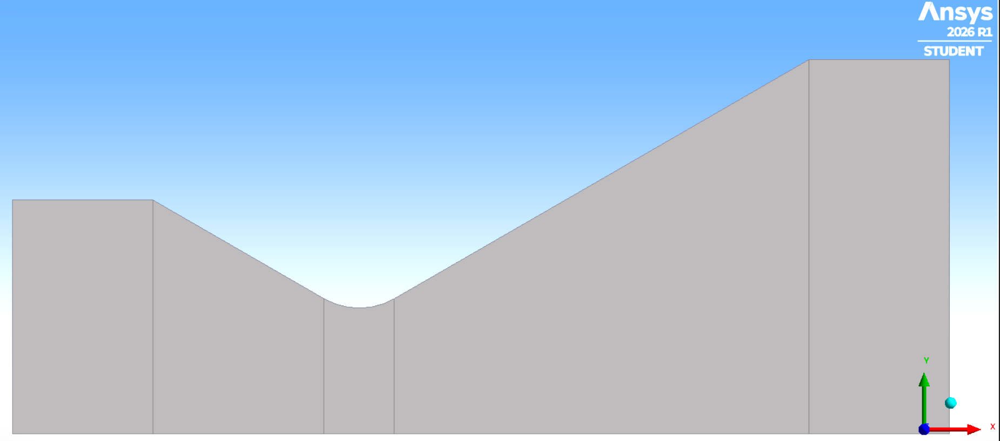
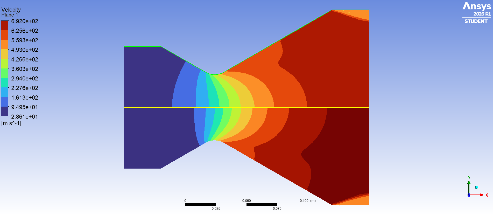
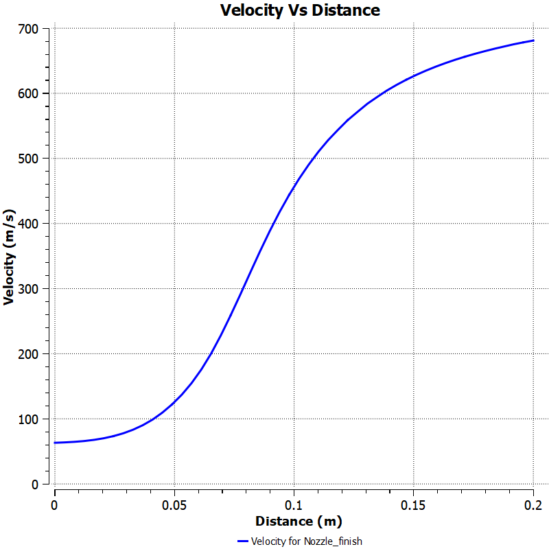
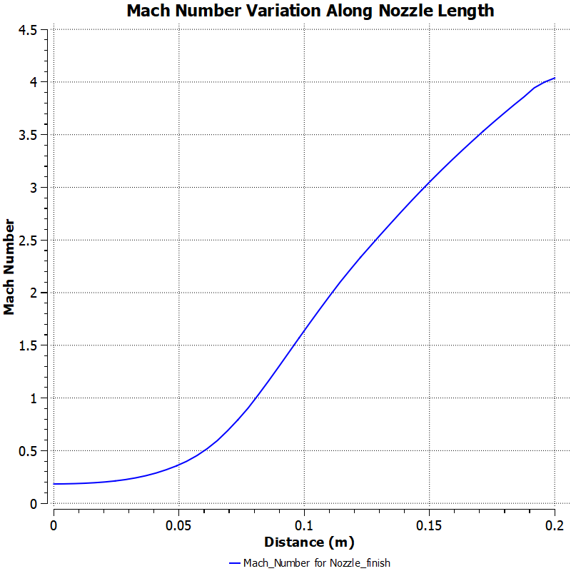
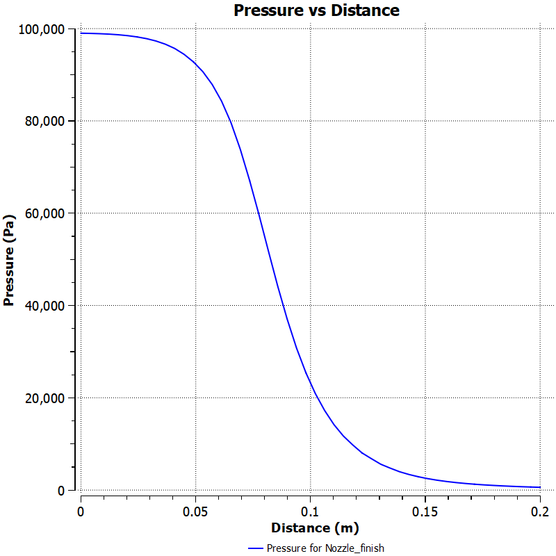
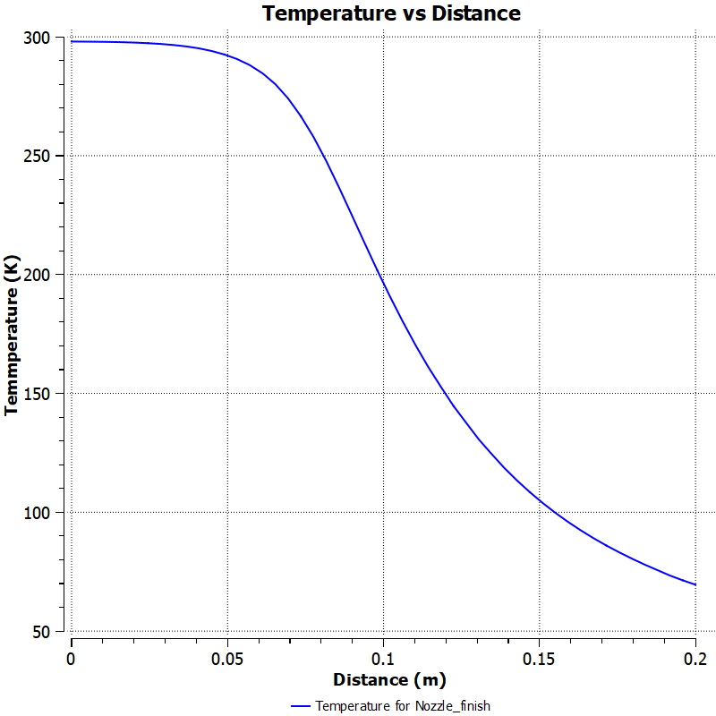

# CFD-Based Nozzle Flow Analysis Integrated with Thrust Calculation using C++

## Overview
This project analyzes compressible flow in a converging-diverging nozzle using CFD and computes thrust using C++ based on simulation results.

## What I Did
- Simulated nozzle flow using ANSYS Fluent  
- Analyzed velocity, pressure, Mach number, and temperature variation  
- Extracted exhaust velocity for RP-1 and LH2 fuels  
- Created a dataset for RP-1 and LH2 fuels  
- Implemented thrust calculation in C++  
- Compared fuel performance based on thrust and efficiency  

## Dataset
Includes:
- Ambient Pressure  
- Fuel Type  
- Fuel Mass  
- Burn Time  
- Exhaust Velocity  
- Thrust  
- Specific Impulse (Isp)  

## Key Observations
- Velocity increases along the nozzle  
- Pressure decreases as velocity increases  
- LH2 produces higher exhaust velocity than RP-1  
- Thrust strongly depends on exhaust velocity  

## Nozzle Geometry
A 2D axisymmetric converging-diverging nozzle was designed to study compressible flow behavior.

## Flow Visualization

## CFD Results

### Velocity Contour
Shows acceleration of flow through the nozzle, with maximum velocity in the diverging section.  

### Mach Number Contour
Indicates increase in Mach number in the diverging section.  

### Pressure Contour
Shows pressure drop along the nozzle as velocity increases.  

### Temperature Contour
Displays variation of temperature due to expansion of flow in the nozzle.  

